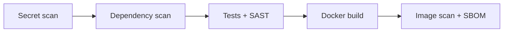

# Container Security Self-Check

[](https://github.com/masonmerrillusu/devsecops-demo/actions/workflows/pipeline.yml)

A small Flask website that runs in Docker and reports on its own container security, wrapped in a GitHub Actions pipeline that blocks insecure code from shipping.

This project is to demonstrate the pipeline, not the website.

## What the website shows

The page inspects the container it is running in and reports:

| Check | Pass condition | Why it matters |
|---|---|---|
| Running user | UID is not 0 | If an attacker exploits the app, they get the app's privileges. Root makes everything after that easier. |
| Listening port | 1024 or higher | Ports below 1024 traditionally need root. An app on 8000 never needs it. |

It also shows the container ID, Python version, Git commit, and build time, so any running container can be traced back to the exact commit that produced it. A `/health` endpoint returns `{"status": "ok"}` for orchestrator health checks.

The same image can be started as root to turn the first check red:

```bash
docker run --rm -p 8000:8000 devsecops-demo            # green: appuser (uid 1000)
docker run --rm -u root -p 8001:8000 devsecops-demo    # red:   root (uid 0)
```

The Dockerfile sets a safe default, but whoever runs the container can override it. That is why real platforms also enforce non-root at run time (for example `runAsNonRoot` in Kubernetes). Build-time hardening and run-time enforcement are separate layers.

## The pipeline

Every push to `main` runs seven stages in order. If any stage fails, everything after it is skipped.



| # | Stage | Tool | What it catches | Why it runs here |
|---|---|---|---|---|
| 1 | Secret scan | Gitleaks | Keys and passwords committed to Git, anywhere in history | Most urgent finding, and the fastest check |
| 2 | Dependency scan | Trivy (`fs`) | Known CVEs in the libraries listed in `requirements.txt` | Stops before anything vulnerable is even installed |
| 3 | Unit tests | pytest | Broken behavior, including the security checks' failure cases | No point building code that does not work |
| 4 | Static analysis | Bandit | Dangerous patterns in the code | Tests prove code works, SAST proves it is not dangerous |
| 5 | Build | Docker | n/a | Only source that passed stages 1 to 4 gets built |
| 6 | Image scan | Trivy (`image`) | CVEs in the base OS and in every installed package | Sees what stage 2 cannot: the OS and transitive dependencies |
| 7 | SBOM | Trivy (CycloneDX) | n/a (inventory, not a check) | A record of exactly what passed, kept as a build artifact |

Trivy runs through plain `docker run` commands rather than a GitHub-specific action.

## Proof that the gates work

A green pipeline proves little on its own, so I broke it on purpose three times. Each mistake is caught by a different stage, which none of the other stages could have caught.

| Mistake | Caught by | Failed run | Fixed run |
|---|---|---|---|
| Hardcoded AWS key in `app/config.py` | 1. Gitleaks | [failed](https://github.com/masonmerrillusu/devsecops-demo/actions/runs/35269415493) | [fixed](https://github.com/masonmerrillusu/devsecops-demo/actions/runs/35274993420) |
| Flask downgraded to 2.2.0 (CVE-2023-30861) | 2. Trivy dependency scan | [failed](https://github.com/masonmerrillusu/devsecops-demo/actions/runs/35275635892/job/105385506567) | [fixed](https://github.com/masonmerrillusu/devsecops-demo/actions/runs/35276248234) |
| `app.run(debug=True)` added to the app | 4. Bandit | [failed](https://github.com/masonmerrillusu/devsecops-demo/actions/runs/35277073738) | [fixed](https://github.com/masonmerrillusu/devsecops-demo/actions/runs/35277334035) |

Clean baseline run: [all stages green](https://github.com/masonmerrillusu/devsecops-demo/actions/runs/35260689388)

Notes on each:

- **Leaked key.** Deleting the file does not fix a leak, because Git history keeps it (`git log -S "AKIA..."` still finds it). The real fix is rotating the key. After that, the specific finding is acknowledged by fingerprint in `.gitleaksignore`, with a written reason. The fingerprint includes the commit ID, so the same key committed again would fail the pipeline again.
- **Vulnerable dependency.** The pipeline stopped before installing anything, so the vulnerable version never ran anywhere. Fixed with `git revert`.
- **Debug mode.** All five unit tests still passed with this change. Working code is not always safe, so the pipeline also cchecks for things like this.

## What I found along the way

Things that came up while learning to build this demo.

- **My first image scan failed with 15 HIGH and CRITICAL findings.** Thirteen were Debian packages where patches already existed but the upstream base image had not been rebuilt, so I added a patch step to the Dockerfile. The other two traced back to libraries bundled inside pip itself. No newer pip existed, so the build removes pip after installing dependencies.
- **The scanner itself can be the threat.** Trivy's distribution channels were compromised in a supply chain attack in March 2026.

## Container hardening

- Slim base image, for a smaller attack surface
- OS security patches applied at build time
- Runs as a non-root user (UID 1000) with no home directory and no login shell
- Application files are owned by root and read-only to the app user
- pip removed from the runtime filesystem
- Only `app/` is copied in: no tests, dev tools, or Git history
- `.dockerignore` keeps `.git`, the virtual environment, and caches out of the build context
- gunicorn as the server, started with `exec` so it receives stop signals and shuts down cleanly
- Unused gunicorn control socket disabled
- Dependencies pinned to exact versions
- Configuration through environment variables, Git commit and build time stamped into the image

## Run it locally

```bash
python3.14 -m venv .venv && source .venv/bin/activate
pip install -r requirements.txt -r requirements-dev.txt
pytest -v
bandit -r app -ll

docker build \
  --build-arg GIT_SHA=$(git rev-parse HEAD) \
  --build-arg BUILD_TIME=$(date -u +%Y-%m-%dT%H:%M:%SZ) \
  -t devsecops-demo .
docker run --rm -p 8000:8000 devsecops-demo
```

Then open http://localhost:8000
